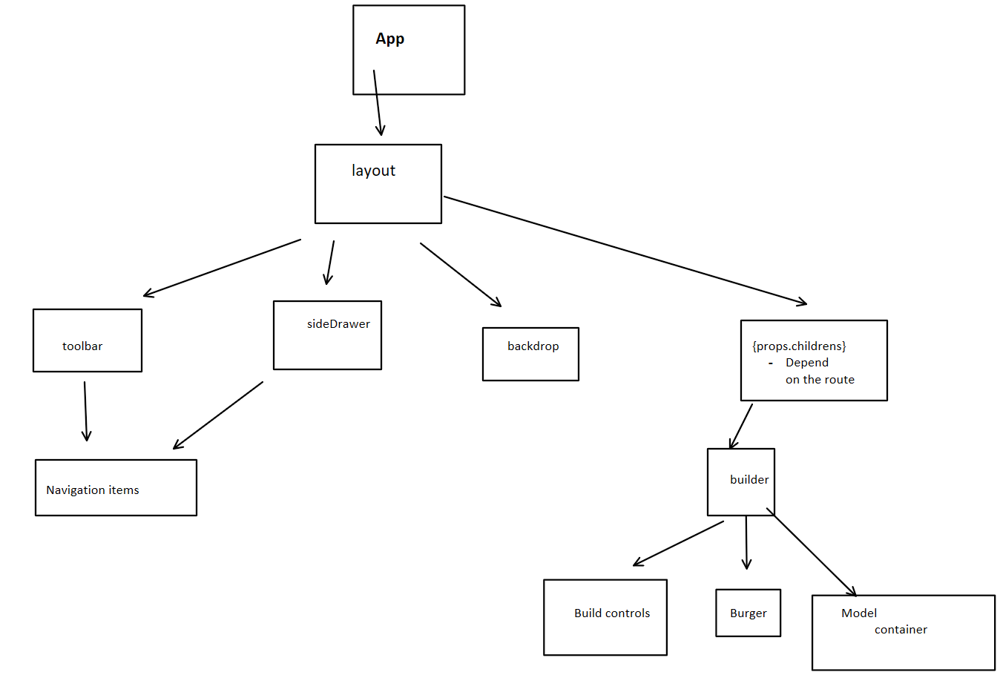

# Plan
- Goal : users can add ingredients and build burgers 
## UI
## header (nav bar)
- from here we can go to 
    - orders
    - burger builder
- and we have a logo
---
## Builder Page
- preview of the burger we are building
  - contains the price
- controls (add and remove)
    - meat
    - salad 
    - ...
- checkout button
----
## Components layout

----
## The State Plan
- should manage the ingredients
- purchased (true, false)
  - did we check the burger out or not
- total price

- manage this state in the Burger builder component 
-----
- **the builder is a stateful component(container)**

